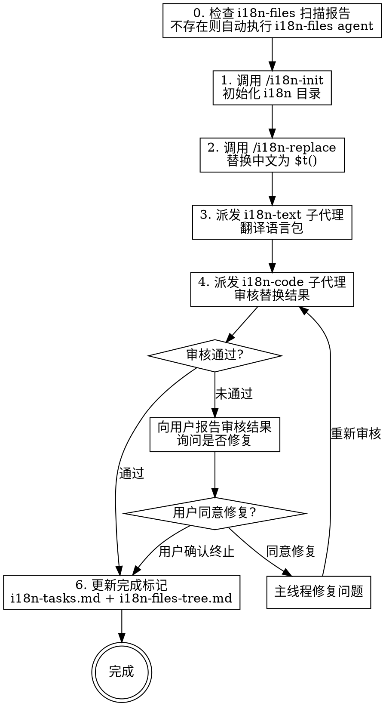

# /i18n-workflow

Vue 项目完整国际化工作流，统一调度 init → replace → translate → review 全流程。

## 用法

```
/i18n-workflow [目标路径] [--langs 语言] [--i18n-dir i18n目录]
```

## 参数

| 参数 | 说明 | 默认值 |
|------|------|--------|
| 目标路径 | 要扫描的目录或文件 | ./src |
| --langs | 目标语言，逗号分隔 | en |
| --i18n-dir | i18n 目录路径 | ./src/i18n |
| --type | 输出类型: esm, browser, vue | vue |

## 工作流程



## AI 执行规则

> **⚠️ 严格按步骤 0 → 1 → 2 → 3 → 4 → 5 顺序执行，禁止跳过任何步骤。**
> **每个步骤执行前必须在输出中标注当前步骤编号（如"【步骤 0】"），以便用户跟踪进度。**

---

### 步骤 0：检查 i18n 目录下的文件树和任务清单【不可跳过】

**这是整个工作流的第一步，无论 i18n 目录是否存在，都必须执行此检查。**

**必须执行的操作**：使用 Glob 工具实际查找以下两个文件（不能凭 i18n 目录存在就假设文件存在）：
- `<i18n-dir>/i18n-files-tree.md`（文件树）
- `<i18n-dir>/i18n-tasks.md`（任务清单）

#### 情况 A：两个文件都存在

1. 使用 Read 工具读取 `i18n-files-tree.md` 和 `i18n-tasks.md` 的完整内容
2. 向用户展示当前 i18n 进度摘要
3. 继续步骤 1

#### 情况 B：两个文件任一不存在（即使 i18n 目录本身已存在）

**必须**派发 `i18n-files` 子代理扫描项目并生成报告，不可跳过：

```
Agent({
  subagent_type: "i18n-files",
  description: "扫描 i18n 进度",
  model: "haiku",
  prompt: "扫描 i18n 所在项目的整个 src 目录，生成全项目 i18n 完成状态文件树和分块任务文档。将文件树写入 <i18n-dir>/i18n-files-tree.md，任务清单写入 <i18n-dir>/i18n-tasks.md。i18n 目录路径为 <i18n-dir>。"
})
```

子代理完成后：
1. 使用 Read 工具读取生成的两个文件，向用户展示扫描结果
2. 如果用户指定了具体目标路径 → 继续步骤 1
3. 如果用户未指定目标路径 → 展示任务清单，询问用户选择要处理的任务块，再继续步骤 1

**常见错误**：i18n 目录存在 ≠ 扫描报告存在。必须用 Glob 实际检查 `i18n-files-tree.md` 和 `i18n-tasks.md` 这两个文件是否存在。

---

### 步骤 1：初始化 i18n 目录

检查 i18n 目录是否已有 `index.js`（或 `index.ts`）和语言 JSON 文件。

- **已有完整配置**（index.js + 目标语言.json 都存在）→ 跳过此步骤（zh.json 不要求，源语言即中文）
- **缺少任一文件** → 调用 `/i18n-init` skill：

```bash
node <i18n-init-skill-directory>/i18n-init.js <i18n-dir> --type <type> --langs <langs>
```

并按 i18n-init 规则修改 `main.js`。

### 步骤 2：替换中文

调用 `/i18n-replace` skill：

```bash
node <i18n-replace-skill-directory>/vue-i18n-replace.js <目标路径> --i18n-dir <i18n-dir> --lang <lang>
```

脚本会替换中文为 `$t()`，并将中文 key 写入语言 JSON（翻译值留空）。

### 步骤 3：翻译语言包

使用 Agent 工具派发 `i18n-text` 子代理：

```
Agent({
  subagent_type: "i18n-text",
  description: "翻译 i18n JSON",
  model: "haiku",
  prompt: "读取 <i18n-dir>/<lang>.json，将所有值为空字符串的条目翻译为<目标语言>。中文 key 是源文本，翻译要准确自然，符合 UI 用语习惯。翻译完成后直接写回文件。"
})
```

如有多个目标语言，为每个语言分别派发子代理，可并行执行。

### 步骤 4：审核替换结果

使用 Agent 工具派发 `i18n-code` 子代理：

```
Agent({
  subagent_type: "i18n-code",
  description: "审核 i18n 替换",
  prompt: "对比 <目标路径> 下 Vue 文件国际化前后的逻辑差异，判断 i18n 替换是否改变了原有代码逻辑。返回审核结果：通过/未通过，以及具体问题列表。"
})
```

### 步骤 5：审核循环

根据 i18n-code 子代理返回的审核结果：

- **审核通过** → 执行步骤 6（更新完成标记）
- **审核未通过** → 执行以下循环：
  1. 向用户展示审核报告（具体问题列表）
  2. 询问用户是否需要修复
  3. 用户同意 → **主线程直接修复问题**（不派发子代理）
  4. 修复完成后 → 重新派发 i18n-code 子代理审核
  5. 重复直到审核通过或用户选择终止
  6. 审核通过后 → 执行步骤 6

---

### 步骤 6：更新完成标记【不可跳过】

当前模块国际化完成后（审核通过或用户确认终止），**必须**更新 i18n 目录下的两个报告文件：

#### 6.1 更新 `<i18n-dir>/i18n-tasks.md`

将本次处理的任务状态从 `☐ 状态：未开始` 改为 `☑ 状态：已完成（YYYY-MM-DD）`：

```markdown
## 任务 1：hygl 模块
- 📁 路径：src/views/hygl/
- 📄 文件：edit.vue (12处), add.vue (8处)
- 📊 预估：约 20 处中文待处理
- 🔧 命令：`/i18n-workflow src/views/hygl/`
- ☑ 状态：已完成（2026-03-12）
```

#### 6.2 更新 `<i18n-dir>/i18n-files-tree.md`

将本次处理的文件状态标记从 ❌ 改为 ✅：

```
之前：❌ edit.vue (未完成, 12 处裸中文)
之后：✅ edit.vue (i18n 完成, 12 个 $t)
```

同时更新文件顶部的进度统计表数据。

#### 6.3 输出完成摘要

更新完标记后，向用户输出摘要：

```
【模块完成】hygl 模块国际化已完成
- 处理文件：2 个
- 新增 $t()：20 处
- 整体进度：已完成 X/Y 模块（XX%）
```
