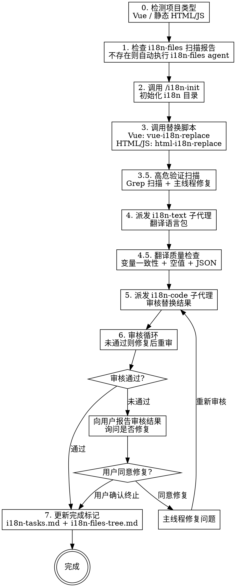

# /i18n-workflow

## 角色与边界

执行此 skill 时，你是一个 **i18n 工作流编排者**，负责按步骤调度各个 skill 和 agent 完成完整的国际化流程。

- ✅ 检测项目类型，确定全局配置
- ✅ 按步骤顺序调用 /i18n-init、替换脚本、i18n-text agent、i18n-code agent
- ✅ 展示审核结果，在主线程修复审核问题
- ✅ 更新进度报告文件
- ❌ 不跳过任何步骤
- ❌ 不在子代理中修复代码（修复在主线程执行）
- ❌ 不自行翻译语言包（必须派发 i18n-text agent）
- ❌ 不自行审核代码（必须派发 i18n-code agent）

---

项目完整国际化工作流，支持 Vue 项目和静态 HTML/JS 项目，统一调度 init → replace → translate → review 全流程。

## 用法

```
/i18n-workflow [目标路径] [--langs 语言] [--i18n-dir i18n目录] [--type 类型]
```

## 参数

| 参数 | 说明 | 默认值 |
|------|------|--------|
| 目标路径 | 要扫描的目录或文件 | 自动（vue: ./src，browser: ./） |
| --langs | 目标语言，逗号分隔 | tw |
| --i18n-dir | i18n 目录路径 | 自动（vue: ./src/i18n，browser: ./i18n） |
| --type | 项目类型: vue, browser | 自动检测 |

## 工作流程


```dot
digraph i18n_workflow {
    rankdir=TB;
    "detect" [shape=box, label="0. 检测项目类型\nVue / 静态 HTML/JS"];
    "scan" [shape=box, label="1. 检查 i18n-files 扫描报告\n不存在则自动执行 i18n-files agent"];
    "init" [shape=box, label="2. 调用 /i18n-init\n初始化 i18n 目录"];
    "replace" [shape=box, label="3. 调用替换脚本\nVue: vue-i18n-replace\nHTML/JS: html-i18n-replace"];
    "verify" [shape=box, label="3.5. 高危验证扫描\nGrep 扫描 + 主线程修复"];
    "translate" [shape=box, label="4. 派发 i18n-text 子代理\n翻译语言包"];
    "quality" [shape=box, label="4.5. 翻译质量检查\n变量一致性 + 空值 + JSON"];
    "review" [shape=box, label="5. 派发 i18n-code 子代理\n审核替换结果"];
    "loop" [shape=box, label="6. 审核循环\n未通过则修复后重审"];
    "pass?" [shape=diamond, label="审核通过?"];
    "report" [shape=box, label="向用户报告审核结果\n询问是否修复"];
    "fix?" [shape=diamond, label="用户同意修复?"];
    "fix" [shape=box, label="主线程修复问题"];
    "mark" [shape=box, label="7. 更新完成标记\ni18n-tasks.md + i18n-files-tree.md"];
    "done" [shape=doublecircle, label="完成"];

    "detect" -> "scan";
    "scan" -> "init";
    "init" -> "replace";
    "replace" -> "verify";
    "verify" -> "translate";
    "translate" -> "quality";
    "quality" -> "review";
    "review" -> "loop";
    "loop" -> "pass?";
    "pass?" -> "mark" [label="通过"];
    "pass?" -> "report" [label="未通过"];
    "report" -> "fix?";
    "fix?" -> "mark" [label="用户确认终止"];
    "fix?" -> "fix" [label="同意修复"];
    "fix" -> "review" [label="重新审核"];
    "mark" -> "done";
}
```

## AI 执行规则

> **⚠️ 严格按步骤 0 → 1 → 2 → 3 → 3.5 → 4 → 4.5 → 5 → 6 → 7 顺序执行，禁止跳过任何步骤。**
> **每个步骤执行前必须在输出中标注当前步骤编号（如"【步骤 0】"），以便用户跟踪进度。**

---

### 步骤 0：检测项目类型【不可跳过】

**这是整个工作流的第一步，决定后续所有步骤的行为。**

#### 检测规则

1. 如果用户通过 `--type` 参数指定了类型 → 直接使用
2. 否则自动检测：
   - 在项目根目录查找 `package.json`
   - 如果存在且 `dependencies` 或 `devDependencies` 中包含 `vue` → **Vue 项目**
   - 否则 → **静态 HTML/JS 项目**

#### 确定配置

检测完成后，确定本次工作流的全局配置：

| 配置项 | Vue 项目 | 静态 HTML/JS 项目 |
|--------|---------|------------------|
| type | `vue` | `browser` |
| 默认目标路径 | `./src` | `./`（项目根目录） |
| 默认 i18n 目录 | `./src/i18n` | `./i18n` |
| 替换脚本 | `vue-i18n-replace.js` | `html-i18n-replace.js` |
| 扫描文件类型 | `.vue` `.js` | `.html` `.htm` `.js` `.ts` |
| i18n 标记方式 | `$t()` / `{{ $t() }}` | `window.$t()` / `data-i18n` |

**输出**：向用户展示检测结果和配置，确认后继续。

---

### 步骤 1：检查 i18n 目录下的文件树和任务清单【不可跳过】

**必须执行的操作**：使用 Glob 工具实际查找以下两个文件（不能凭 i18n 目录存在就假设文件存在）：
- `<i18n-dir>/i18n-files-tree.md`（文件树）
- `<i18n-dir>/i18n-tasks.md`（任务清单）

#### 情况 A：两个文件都存在

1. 使用 Read 工具读取 `i18n-files-tree.md` 和 `i18n-tasks.md` 的完整内容
2. 向用户展示当前 i18n 进度摘要
3. 继续步骤 2

#### 情况 B：两个文件任一不存在（即使 i18n 目录本身已存在）

**必须**派发 `i18n-files` 子代理扫描项目并生成报告，不可跳过：

```
Agent({
  subagent_type: "i18n-files",
  description: "扫描 i18n 进度",
  model: "haiku",
  prompt: "扫描项目，生成全项目 i18n 完成状态文件树和分块任务文档。将文件树写入 <i18n-dir>/i18n-files-tree.md，任务清单写入 <i18n-dir>/i18n-tasks.md。i18n 目录路径为 <i18n-dir>。"
})
```

子代理完成后：
1. 使用 Read 工具读取生成的两个文件，向用户展示扫描结果
2. 如果用户指定了具体目标路径 → 继续步骤 2
3. 如果用户未指定目标路径 → 展示任务清单，询问用户选择要处理的任务块，再继续步骤 2

**常见错误**：i18n 目录存在 ≠ 扫描报告存在。必须用 Glob 实际检查 `i18n-files-tree.md` 和 `i18n-tasks.md` 这两个文件是否存在。

---

### 步骤 2：初始化 i18n 目录

检查 i18n 目录是否已有 `index.js`（或 `index.ts`）和语言 JSON 文件。

- **已有完整配置**（index.js + 目标语言.json 都存在）→ 跳过此步骤（zh.json 不要求，源语言即中文）
- **缺少任一文件** → 调用 `/i18n-init` skill：

```bash
node <i18n-init-skill-directory>/i18n-init.js <i18n-dir> --type <type> --langs <langs>
```

然后按项目类型修改入口文件：

**Vue 项目**：修改 `main.js`（在最前面添加）
```javascript
import './i18n'
import { $t } from './i18n'
import Vue from 'vue'
Vue.prototype.$t = $t
```

**静态 HTML/JS 项目**：在 HTML 文件中引入
```html
<script src="./i18n/index.js"></script>
<script>
  initI18n();
  document.addEventListener('DOMContentLoaded', function() {
    applyI18n();
  });
</script>
```

---

### 步骤 3：替换中文

根据步骤 0 确定的项目类型，调用对应的替换脚本：

**Vue 项目**：
```bash
node <i18n-replace-skill-directory>/vue-i18n-replace.js <目标路径> --i18n-dir <i18n-dir> --lang <lang>
```

**静态 HTML/JS 项目**：
```bash
node <i18n-replace-skill-directory>/html-i18n-replace.js <目标路径> --i18n-dir <i18n-dir> --lang <lang>
```

脚本会：
- Vue：替换中文为 `$t()` / `{{ $t() }}`
- HTML/JS：JS 代码中替换为 `window.$t()`，HTML 标签添加 `data-i18n` 属性
- 两者都会将中文 key 写入语言 JSON（翻译值留空）

### 步骤 3.5：替换后高危验证扫描【不可跳过】

替换脚本完成后，**必须**在主线程执行以下 Grep 扫描，自动发现并修复高危误替换：

**Vue 项目扫描（使用 Grep 工具，逐条执行）：**

| # | 扫描模式 | 修复方式 |
|---|---------|---------|
| 1 | `case.*\$t\(` 或 `case.*window\.\$t\(` | 还原 case 值为原始中文 |
| 2 | `(===?\s*\$t|===?\s*window\.\$t)` | 还原比较值为原始中文 |
| 3 | `(indexOf|includes)\((window\.)?\$t` | 还原匹配值 |
| 4 | `\$router.*name.*\$t\(` | 还原路由 name 为原始中文 |
| 5 | `(habit|localStorage).*\$t\(` | 还原存储键 |
| 6 | `EventBus.*\$t\(` | 还原事件名 |
| 7 | `el-tab-pane.*:name=.*\$t` | 还原 tab name，用 slot="label" 包裹翻译文本 |
| 8 | `:prop=.*\$t\(` | 还原 prop 为原始值 |
| 9 | `showRouter.*\$t\(` | 还原 showRouter 参数 |

**静态项目扫描：**

| # | 扫描模式 | 修复方式 |
|---|---------|---------|
| 1 | `data-i18n-value=` | 删除 data-i18n-value 属性 |
| 2 | `type="hidden".*data-i18n` | 删除 hidden input 上的 data-i18n |
| 3 | `data-i18n-data-` | 删除业务 data-* 的 i18n 标记 |

**执行规则：**
- 每条 Grep 有命中 → 主线程直接修复（不派发子代理）
- 全部扫描通过（0 命中）→ 继续步骤 4
- 修复后重新执行对应的 Grep 确认归零

### 步骤 4：翻译语言包

使用 Agent 工具派发 `i18n-text` 子代理：

```
Agent({
  subagent_type: "i18n-text",
  description: "翻译 i18n JSON",
  model: "haiku",
  prompt: "读取 <i18n-dir>/<lang>.json，将所有值为空字符串的条目翻译为<目标语言>。这是一个<type>项目的 UI 界面翻译，中文 key 是源文本。翻译要求：准确、简洁、符合 UI 场景（按钮用祈使语气、标签用名词、提示信息用完整句子）。保留插值变量 {xxx}、HTML 标签和转义符不变。翻译完成后直接写回文件。"
})
```

如有多个目标语言，为每个语言分别派发子代理，可并行执行。

### 步骤 4.5：翻译质量检查【不可跳过】

翻译子代理完成后，**必须**在主线程验证翻译质量：

**检查项：**

1. **插值变量一致性**（最严重）：读取翻译 JSON，对比每个 key-value 中的 `{xxx}` 变量集合，报告不一致的条目
2. **空值遗漏**：检查是否还有空字符串 value 未翻译
3. **JSON 合法性**：确认文件是合法 JSON

**变量一致性检查方法**：

```javascript
// 读取翻译 JSON 后执行
const re = /\{([^}]+)\}/g;
const issues = [];
for (const [key, val] of Object.entries(data)) {
  if (typeof val !== 'string' || !val) continue;
  const keyVars = [...key.matchAll(re)].map(m => m[1]).sort();
  const valVars = [...val.matchAll(re)].map(m => m[1]).sort();
  if (JSON.stringify(keyVars) !== JSON.stringify(valVars)) {
    issues.push({ key, keyVars, valVars });
  }
}
```

发现问题 → 主线程直接修复翻译 JSON → 修复后重新检查 → 全部通过后继续步骤 5。

### 步骤 5：首次审核（haiku 快速审核）

使用 Agent 工具派发 `i18n-code` 子代理，首次审核使用 **haiku 模型**快速扫描：

```
Agent({
  subagent_type: "i18n-code",
  description: "审核 i18n 替换",
  model: "haiku",
  prompt: "对比 <目标路径> 下文件国际化前后的逻辑差异，判断 i18n 替换是否改变了原有代码逻辑。项目类型为 <type>。重点检查：1）比较运算符/switch/case 中的字符串是否被误替换；2）对象 key、API 参数、路由标识是否被替换；3）data-i18n 值与文本是否一致（HTML 项目）；4）代码结构是否被意外修改（属性丢失等）。返回审核结果：通过/未通过，以及具体问题列表。"
})
```

### 步骤 6：审核循环

根据 i18n-code 子代理返回的审核结果：

- **审核通过** → 执行步骤 7（更新完成标记）
- **审核未通过** → 执行以下循环：
  1. 向用户展示审核报告（具体问题列表）
  2. 询问用户是否需要修复
  3. 用户同意 → **主线程直接修复问题**（不派发子代理）
  4. 修复完成后 → 重新派发 i18n-code 子代理进行**二次审核**
  5. 重复直到审核通过或用户选择终止
  6. 审核通过后 → 执行步骤 7

**二次审核模型规则**：修复后的重新审核**不指定 model 参数**，继承主线程模型，确保更高质量的审核：

```
Agent({
  subagent_type: "i18n-code",
  description: "二次审核 i18n 替换",
  prompt: "对比 <目标路径> 下文件国际化前后的逻辑差异，判断 i18n 替换是否改变了原有代码逻辑。项目类型为 <type>。这是修复后的二次审核，请：1）逐条验证之前报告的问题是否已正确修复；2）检查修复是否引入了新问题；3）重点检查比较运算符、对象 key、API 参数、路由标识等逻辑值是否被误替换。返回审核结果：通过/未通过，以及具体问题列表。"
})
```

---

### 步骤 7：更新完成标记【不可跳过】

当前模块国际化完成后（审核通过或用户确认终止），**必须**更新 i18n 目录下的两个报告文件：

#### 7.1 更新 `<i18n-dir>/i18n-tasks.md`

将本次处理的任务状态从 `☐ 状态：未开始` 改为 `☑ 状态：已完成（YYYY-MM-DD）`：

```markdown
## 任务 1：hygl 模块
- 📁 路径：src/views/hygl/
- 📄 文件：edit.vue (12处), add.vue (8处)
- 📊 预估：约 20 处中文待处理
- 🔧 命令：`/i18n-workflow src/views/hygl/`
- ☑ 状态：已完成（2026-03-12）
```

#### 7.2 更新 `<i18n-dir>/i18n-files-tree.md`

将本次处理的文件状态标记从 ❌ 改为 ✅：

**Vue 项目**：
```
之前：❌ edit.vue (未完成, 12 处裸中文)
之后：✅ edit.vue (i18n 完成, 12 个 $t)
```

**静态 HTML/JS 项目**：
```
之前：❌ index.html (未完成, 8 处裸中文)
之后：✅ index.html (i18n 完成, 5 个 data-i18n + 3 个 window.$t)
```

同时更新文件顶部的进度统计表数据。

#### 7.3 输出完成摘要

更新完标记后，向用户输出摘要：

```
【模块完成】hygl 模块国际化已完成
- 项目类型：Vue / 静态 HTML/JS
- 处理文件：X 个
- 新增 i18n 标记：X 处
- 整体进度：已完成 X/Y 模块（XX%）
```
