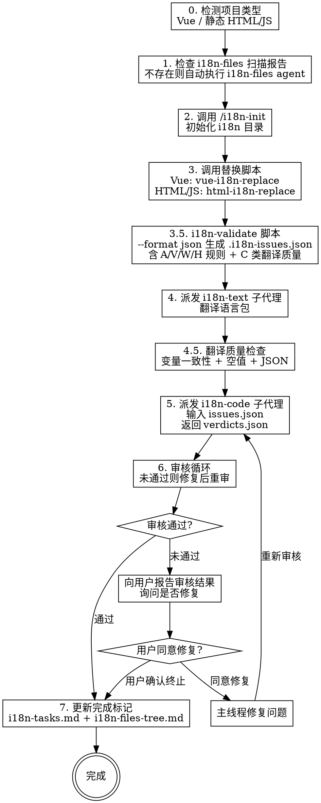

# /i18n-workflow

## 角色与边界

执行此 skill 时，你是一个 **i18n 工作流编排者**，负责按步骤调度各个 skill 和 agent 完成完整的国际化流程。

- ✅ 检测项目类型，确定全局配置
- ✅ 按步骤顺序调用 /i18n-init、替换脚本、i18n-text agent、i18n-code agent
- ✅ 展示审核结果，在主线程修复审核问题
- ✅ 更新进度报告文件
- ❌ 不跳过任何步骤
- ❌ 不在子代理中修复代码（修复在主线程执行）
- ❌ 不自行翻译语言包（必须派发 i18n-text agent）
- ❌ 不自行审核代码（必须派发 i18n-code agent）

---

项目完整国际化工作流，支持 Vue 项目和静态 HTML/JS 项目，统一调度 init → replace → translate → review 全流程。

## 用法

```
/i18n-workflow [目标路径] [--langs 语言] [--i18n-dir i18n目录] [--type 类型]
```

## 参数

| 参数 | 说明 | 默认值 |
|------|------|--------|
| 目标路径 | 要扫描的目录或文件 | 自动（vue: ./src，browser: ./） |
| --langs | 目标语言，逗号分隔 | tw |
| --i18n-dir | i18n 目录路径 | 自动（vue: ./src/i18n，browser: ./i18n） |
| --type | 项目类型: vue, browser, wx | 自动检测 |

## 工作流程


```dot
digraph i18n_workflow {
    rankdir=TB;
    "detect" [shape=box, label="0. 检测项目类型\nVue / 静态 HTML/JS"];
    "scan" [shape=box, label="1. 检查 i18n-files 扫描报告\n不存在则自动执行 i18n-files agent"];
    "init" [shape=box, label="2. 调用 /i18n-init\n初始化 i18n 目录"];
    "replace" [shape=box, label="3. 调用替换脚本\nVue: vue-i18n-replace\nHTML/JS: html-i18n-replace"];
    "validate" [shape=box, label="3.5. i18n-validate 脚本\n--format json 生成 .i18n-issues.json\n含 A/V/W/H 规则 + C 类翻译质量"];
    "translate" [shape=box, label="4. 派发 i18n-text 子代理\n翻译语言包"];
    "quality" [shape=box, label="4.5. 翻译质量检查\n变量一致性 + 空值 + JSON"];
    "review" [shape=box, label="5. 派发 i18n-code 子代理\n输入 issues.json\n返回 verdicts.json"];
    "loop" [shape=box, label="6. 审核循环\n未通过则修复后重审"];
    "pass?" [shape=diamond, label="审核通过?"];
    "report" [shape=box, label="向用户报告审核结果\n询问是否修复"];
    "fix?" [shape=diamond, label="用户同意修复?"];
    "fix" [shape=box, label="主线程修复问题"];
    "mark" [shape=box, label="7. 更新完成标记\ni18n-tasks.md + i18n-files-tree.md"];
    "done" [shape=doublecircle, label="完成"];

    "detect" -> "scan";
    "scan" -> "init";
    "init" -> "replace";
    "replace" -> "validate";
    "validate" -> "translate";
    "translate" -> "quality";
    "quality" -> "review";
    "review" -> "loop";
    "loop" -> "pass?";
    "pass?" -> "mark" [label="通过"];
    "pass?" -> "report" [label="未通过"];
    "report" -> "fix?";
    "fix?" -> "mark" [label="用户确认终止"];
    "fix?" -> "fix" [label="同意修复"];
    "fix" -> "review" [label="重新审核"];
    "mark" -> "done";
}
```

## AI 执行规则

> **⚠️ 严格按步骤 0 → 1 → 2 → 3 → 3.5 → 4 → 4.5 → 5 → 6 → 7 顺序执行，禁止跳过任何步骤。**
> **每个步骤执行前必须在输出中标注当前步骤编号（如"【步骤 0】"），以便用户跟踪进度。**

---

### 步骤 0：检测项目类型【不可跳过】

**这是整个工作流的第一步，决定后续所有步骤的行为。**

#### 检测规则

1. 如果用户通过 `--type` 参数指定了类型 → 直接使用
2. 否则自动检测：
   - 在项目根目录查找 `package.json`
   - 如果存在且 `dependencies` 或 `devDependencies` 中包含 `vue` → **Vue 项目**
   - 如果存在 `app.json` 且 `package.json` 中无 `vue` 依赖 → **微信小程序**（wx）
   - 否则 → **静态 HTML/JS 项目**

#### 确定配置

检测完成后，确定本次工作流的全局配置：

| 配置项 | Vue 项目 | 静态 HTML/JS 项目 | 微信小程序 |
|--------|---------|------------------|-----------|
| type | `vue` | `browser` | `wx` |
| 默认目标路径 | `./src` | `./`（项目根目录） | `./`（项目根目录） |
| 默认 i18n 目录 | `./src/i18n` | `./i18n` | `./i18n` |
| 替换脚本 | `vue-i18n-replace.js` | `html-i18n-replace.js` | `wx-i18n-replace.js` |
| 扫描文件类型 | `.vue` `.js` | `.html` `.htm` `.js` `.ts` | `.wxml` `.js` |
| i18n 标记方式 | `$t()` / `{{ $t() }}` | `window.$t()` / `data-i18n` | `global.$t()` / `{{$t['key']}}` |
| 核心文件名 | `index.js` | `index.js` | `i18n.js` |

**输出**：向用户展示检测结果和配置，确认后继续。

---

### 状态追踪机制

工作流启动时在 i18n 目录下创建或读取 `.i18n-workflow-state.json`：

```json
{
  "version": "1.0",
  "projectType": "vue",
  "targetPath": "./src",
  "langs": ["en"],
  "currentStep": "3.5",
  "completedSteps": ["0", "1", "2", "3"],
  "lastUpdated": "2026-04-02T10:30:00Z"
}
```

**规则：**
- 每完成一个步骤，更新 `currentStep` 和 `completedSteps`
- 新会话检测到状态文件时提示：> "检测到上次工作流在步骤 {currentStep} 中断。是否继续？"
- 用户确认继续 → 跳过已完成步骤
- 用户选择重新开始 → 清空状态文件
- 工作流完成（步骤 7）→ 删除状态文件

---

### 步骤 1：检查 i18n 目录下的文件树和任务清单【不可跳过】

**必须执行的操作**：使用 Glob 工具实际查找以下两个文件（不能凭 i18n 目录存在就假设文件存在）：
- `<i18n-dir>/i18n-files-tree.md`（文件树）
- `<i18n-dir>/i18n-tasks.md`（任务清单）

#### 情况 A：两个文件都存在

1. 使用 Read 工具读取 `i18n-files-tree.md` 和 `i18n-tasks.md` 的完整内容
2. 向用户展示当前 i18n 进度摘要
3. 继续步骤 2

#### 情况 B：两个文件任一不存在（即使 i18n 目录本身已存在）

**必须**派发 `i18n-files` 子代理扫描项目并生成报告，不可跳过：

```
subagent: i18n-files
model: haiku
task: 扫描 i18n 进度
prompt: 扫描项目，生成全项目 i18n 完成状态文件树和分块任务文档。将文件树写入 <i18n-dir>/i18n-files-tree.md，任务清单写入 <i18n-dir>/i18n-tasks.md。i18n 目录路径为 <i18n-dir>。
```

子代理完成后：
1. 使用 Read 工具读取生成的两个文件，向用户展示扫描结果
2. 如果用户指定了具体目标路径 → 继续步骤 2
3. 如果用户未指定目标路径 → 展示任务清单，询问用户选择要处理的任务块，再继续步骤 2

**常见错误**：i18n 目录存在 ≠ 扫描报告存在。必须用 Glob 实际检查 `i18n-files-tree.md` 和 `i18n-tasks.md` 这两个文件是否存在。

---

### 步骤 2：初始化 i18n 目录

检查 i18n 目录是否已有核心文件和语言 JSON 文件。
- Vue/browser/esm：检查 `index.js`（或 `index.ts`）
- wx（微信小程序）：检查 `i18n.js`

- **已有完整配置**（核心文件 + 目标语言包都存在）→ 跳过此步骤（zh 不要求，源语言即中文）
  - Vue/browser：检查 `<lang>.json`
  - wx：检查 `<lang>.js`（小程序不支持 require .json）
- **缺少任一文件** → 调用 `/i18n-init` skill：

```bash
node <i18n-init-skill-directory>/i18n-init.js <i18n-dir> --type <type> --langs <langs>
```

然后按项目类型修改入口文件：

**Vue 项目**：修改 `main.js`（在最前面添加）
```javascript
import './i18n'
import { $t } from './i18n'
import Vue from 'vue'
Vue.prototype.$t = $t
```

**静态 HTML/JS 项目**：在 HTML 文件中引入
```html
<script src="./i18n/index.js"></script>
<script>
  initI18n();
  document.addEventListener('DOMContentLoaded', function() {
    applyI18n();
  });
</script>
```

**微信小程序（wx）**：init 脚本自动生成 `i18n.js` + `i18n-behavior.js`，需在 `app.js` 顶部添加：
```javascript
require('./i18n/i18n.js')
```

`app.js` 的 `onLaunch` 中插入（注释状态，上线时取消注释改 URL）：
```javascript
// [i18n] 上线时取消注释并修改为云端地址
// await global.loadRemoteLocale('https://your-api.com/i18n/tw.js', 'tw')
```

**初始化后必检（静态项目）：**
- 检查 `<html lang="...">` 属性，如果是 `lang="en"`（常见模板默认值），必须改为 `lang="zh"`，否则语言检测优先级会误判为英文环境。

---

### 步骤 3：替换中文

根据步骤 0 确定的项目类型，调用对应的替换脚本：

**Vue 项目**：
```bash
node <i18n-replace-skill-directory>/vue-i18n-replace.js <目标路径> --i18n-dir <i18n-dir> --lang <lang>
```

**静态 HTML/JS 项目**：
```bash
node <i18n-replace-skill-directory>/html-i18n-replace.js <目标路径> --i18n-dir <i18n-dir> --lang <lang>
```

**微信小程序（wx）**：调用 `wx-i18n-replace.js` 替换中文 + 自动注入 Behavior
```bash
node <i18n-replace-skill-directory>/wx-i18n-replace.js <目标路径> --i18n-dir <i18n-dir> --lang <lang>
```

脚本会：
- Vue：替换中文为 `$t()` / `{{ $t() }}`
- HTML/JS：JS 代码中替换为 `window.$t()`，HTML 标签添加 `data-i18n` 属性
- wx：WXML 中替换为 `{{$t['key']}}`，JS 中替换为 `global.$t()`，自动注入 i18n Behavior
- 所有类型都会将中文 key 写入语言 JSON（翻译值留空）

### 步骤 3.5：运行 i18n-validate 脚本【不可跳过】

替换脚本完成后，**必须**在主线程执行 `i18n-validate.js`，它是一个内置 28+ 条高危规则的 Node 脚本（V01-V10 Vue、W01-W08 wx、H01-H05 HTML、A1-A14 跨类型、C1-C4 翻译质量）。

**执行命令：**

```bash
node <plugin-path>/skills/i18n-replace/i18n-validate.js <target-dir> \
  --type <vue|wx|html> \
  --i18n-dir <path> \
  --lang <lang> \
  --format json \
  --out <target-dir>/.i18n-issues.json
```

**退出码规则：**

| code | 含义 | 下一步 |
|------|------|--------|
| 0 | 全绿（无任何问题） | **跳过步骤 5**，直接进入步骤 7 |
| 1 | 存在 🔴 严重问题 | 继续步骤 5（派发 agent） |
| 2 | 存在 🟠 高危问题（无 🔴） | 继续步骤 5（派发 agent） |
| 3 | 脚本自身错误 | 报告用户并终止 |

`.i18n-issues.json` 是**步骤 5 的输入**，主线程不要自行修复——让 i18n-code agent 先给 verdict，再决定修哪些。

**JSON 清理（可选）：**
运行 `i18n-validate.js --check-json` 检查翻译 JSON 中的可疑条目（第三方库、数据映射字段等），可选清理。

### 步骤 4：翻译语言包

派发 `i18n-text` 子代理。注意语言包文件格式：
- Vue/browser 项目：`<lang>.json`（标准 JSON）
- wx 项目：`<lang>.js`（`module.exports = {...}` 格式，读取时去掉 `module.exports = ` 前缀按 JSON 解析，写回时加回前缀）

```
subagent: i18n-text
model: haiku
task: 翻译 i18n 语言包
prompt: 读取 <i18n-dir>/<lang文件>（Vue/browser 为 .json，wx 为 .js），将所有值为空字符串的条目翻译为<目标语言>。这是一个<type>项目的 UI 界面翻译，中文 key 是源文本。翻译要求：准确、简洁、符合 UI 场景（按钮用祈使语气、标签用名词、提示信息用完整句子）。保留插值变量 {xxx}、HTML 标签和转义符不变。翻译完成后直接写回文件。如果是 .js 格式，写回时保持 module.exports = {...} 格式。
```

如有多个目标语言，为每个语言分别派发子代理，可并行执行。

### 步骤 4.5：翻译质量检查【不可跳过】

翻译子代理完成后，**必须**在主线程验证翻译质量：

**检查项：**

1. **插值变量一致性**（最严重）：读取翻译 JSON，对比每个 key-value 中的 `{xxx}` 变量集合，报告不一致的条目
2. **空值遗漏**：检查是否还有空字符串 value 未翻译
3. **JSON 合法性**：确认文件是合法 JSON

**变量一致性检查方法**：

```javascript
// 读取翻译 JSON 后执行
const re = /\{([^}]+)\}/g;
const issues = [];
for (const [key, val] of Object.entries(data)) {
  if (typeof val !== 'string' || !val) continue;
  const keyVars = [...key.matchAll(re)].map(m => m[1]).sort();
  const valVars = [...val.matchAll(re)].map(m => m[1]).sort();
  if (JSON.stringify(keyVars) !== JSON.stringify(valVars)) {
    issues.push({ key, keyVars, valVars });
  }
}
```

发现问题 → 主线程直接修复翻译 JSON → 修复后重新检查 → 全部通过后继续步骤 5。

**自动化检查（推荐替代手动代码）：**

```bash
node <plugin-path>/skills/i18n-replace/i18n-validate.js <target-dir> --check-translation --i18n-dir <path> --lang <lang>
```

### 步骤 5：派发 i18n-code agent 做语义判断（JSON 协议）

**前提**：步骤 3.5 已生成 `.i18n-issues.json`，且退出码为 1 或 2。

派发 `i18n-code` 子代理，**必须指定 `model: "haiku"`**，prompt 必须包含 issues.json 路径：

```
subagent: i18n-code
model: haiku
task: 对 i18n-validate 产出的 issues.json 做语义判断
prompt: |
  请 Read 文件 <target-dir>/.i18n-issues.json（由 i18n-validate 生成）。
  对每一条 issue 按 agent 判断手册给出 verdict：
  - confirmed: 真问题
  - falsePositive: 误报（必须说明原因）
  - needsContext: 需要补充上下文（必须指明要 Read 哪个文件哪一段）
  严格按 JSON schema 输出 verdicts，包裹在 ```json``` 代码块中。
  项目类型: <type>。
```

**主线程收到 verdicts 后的硬约束**：

1. **数量校验**：`verdicts.length === issues.length` —— 不匹配则报"偷懒警告"，重派一次
2. **reason 长度校验**：每条 verdict 的 reason 至少 20 字
3. **falsePositive 必须有原因**
4. **needsContext 必须指明文件路径和范围**，主线程按需 Read 上下文并重派

**修复策略**：

- 对所有 `confirmed` 的 verdict，按 `fixSuggestion` 在主线程修复（不派发子代理）
- 对 `needsContext` 的 verdict，主线程先补充上下文再重派
- 对 `falsePositive` 的 verdict，不修复，但记录到审核日志

**修复后重跑 validator 确认清零**：

```bash
node <plugin-path>/skills/i18n-replace/i18n-validate.js <target-dir> --type <type> --format json --out <target-dir>/.i18n-issues.json
```

**循环上限**：如果循环 3 轮仍有 🔴/🟠，输出"疑难问题清单"交人工处理，不要死循环。

### 步骤 6：审核循环

根据 i18n-code 子代理返回的审核结果：

- **审核通过** → 执行步骤 7（更新完成标记）
- **审核未通过** → 执行以下循环：
  1. 向用户展示审核报告（具体问题列表）
  2. 询问用户是否需要修复
  3. 用户同意 → **主线程直接修复问题**（不派发子代理）
  4. 修复完成后 → 重新派发 i18n-code 子代理进行**二次审核**
  5. 重复直到审核通过或用户选择终止
  6. 审核通过后 → 执行步骤 7

**二次审核模型规则**：修复后的重新审核**不指定 model 参数**，继承主线程模型，确保更高质量的审核：

```
subagent: i18n-code
task: 二次审核 i18n 替换
prompt: 对比 <目标路径> 下文件国际化前后的逻辑差异，判断 i18n 替换是否改变了原有代码逻辑。项目类型为 <type>。这是修复后的二次审核，请：1）逐条验证之前报告的问题是否已正确修复；2）检查修复是否引入了新问题；3）重点检查比较运算符、对象 key、API 参数、路由标识等逻辑值是否被误替换。返回审核结果：通过/未通过，以及具体问题列表。
```

---

### 步骤 7：更新完成标记【不可跳过】

当前模块国际化完成后（审核通过或用户确认终止），**必须**更新 i18n 目录下的两个报告文件：

#### 7.1 更新 `<i18n-dir>/i18n-tasks.md`

将本次处理的任务状态从 `☐ 状态：未开始` 改为 `☑ 状态：已完成（YYYY-MM-DD）`：

```markdown
## 任务 1：hygl 模块
- 📁 路径：src/views/hygl/
- 📄 文件：edit.vue (12处), add.vue (8处)
- 📊 预估：约 20 处中文待处理
- 🔧 命令：`/i18n-workflow src/views/hygl/`
- ☑ 状态：已完成（2026-03-12）
```

#### 7.2 更新 `<i18n-dir>/i18n-files-tree.md`

将本次处理的文件状态标记从 ❌ 改为 ✅：

**Vue 项目**：
```
之前：❌ edit.vue (未完成, 12 处裸中文)
之后：✅ edit.vue (i18n 完成, 12 个 $t)
```

**静态 HTML/JS 项目**：
```
之前：❌ index.html (未完成, 8 处裸中文)
之后：✅ index.html (i18n 完成, 5 个 data-i18n + 3 个 window.$t)
```

同时更新文件顶部的进度统计表数据。

#### 7.3 输出完成摘要

更新完标记后，向用户输出摘要：

```
【模块完成】hygl 模块国际化已完成
- 项目类型：Vue / 静态 HTML/JS
- 处理文件：X 个
- 新增 i18n 标记：X 处
- 整体进度：已完成 X/Y 模块（XX%）
```
